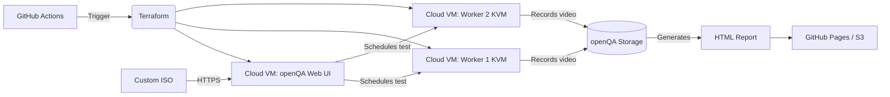

# 🐧 Linux Distribution QA with openQA

Automated end-to-end testing of **Linux ISO images** using **openQA** — the same system used by openSUSE and Fedora.

This repo provides:
- Terraform modules to deploy openQA on cloud VMs
- Example test scenarios for custom distros
- Needle-based screenshot validation
- Full lifecycle: ISO → install → boot → test → report

---

## 🔧 Architecture



### Компоненты:

- **openQA Web UI**: координатор тестов, веб-интерфейс, API
- **Worker Nodes**: KVM-машины с включённой виртуализацией
- **Storage**: общий том для ISO, needles, видео, отчётов
- **GitHub Actions**: триггер развёртывания и загрузки ISO


## 🧩 What is openQA?

openQA is an **automated test framework** that:
- Boots ISO in KVM
- Records full video of installation
- Compares screenshots against “needles” (expected states)
- Detects regressions in UI, boot process, package install

> Used by: **openSUSE**, **Fedora**, **Ubuntu**, **Debian**

---

## ☁️ Deployment

```bash
cd terraform/
terraform init
terraform apply -var="iso_url=https://example.com/my-distro.iso"
