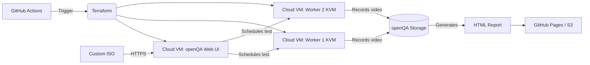

## 🔧 Architecture

### Компоненты:

- **openQA Web UI**: координатор тестов, веб-интерфейс, API
- **Worker Nodes**: KVM-машины с включённой виртуализацией
- **Storage**: общий том для ISO, needles, видео, отчётов
- **GitHub Actions**: триггер развёртывания и загрузки ISO
